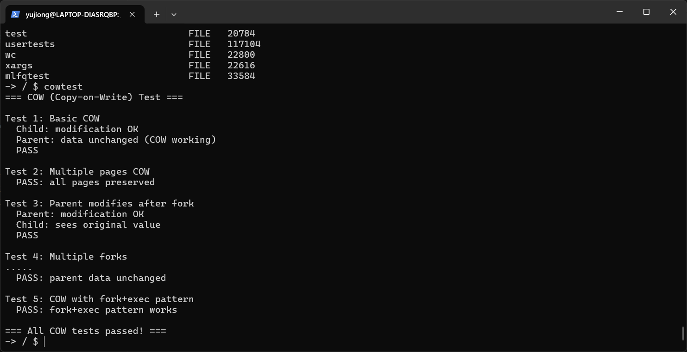
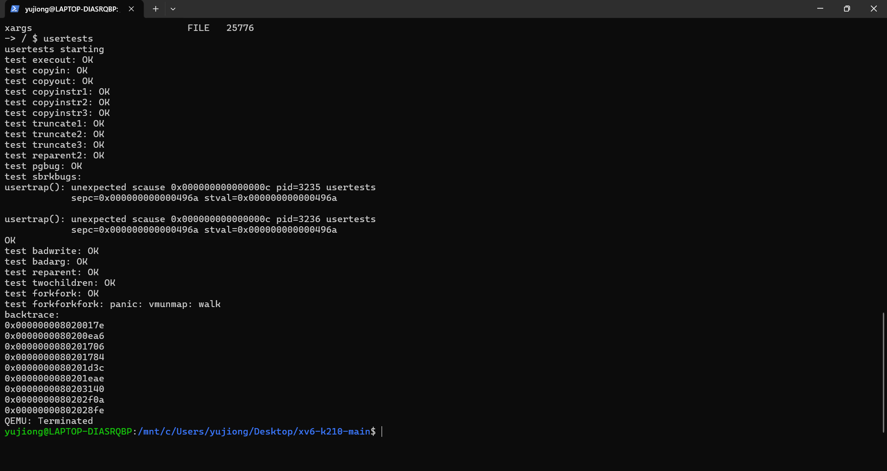
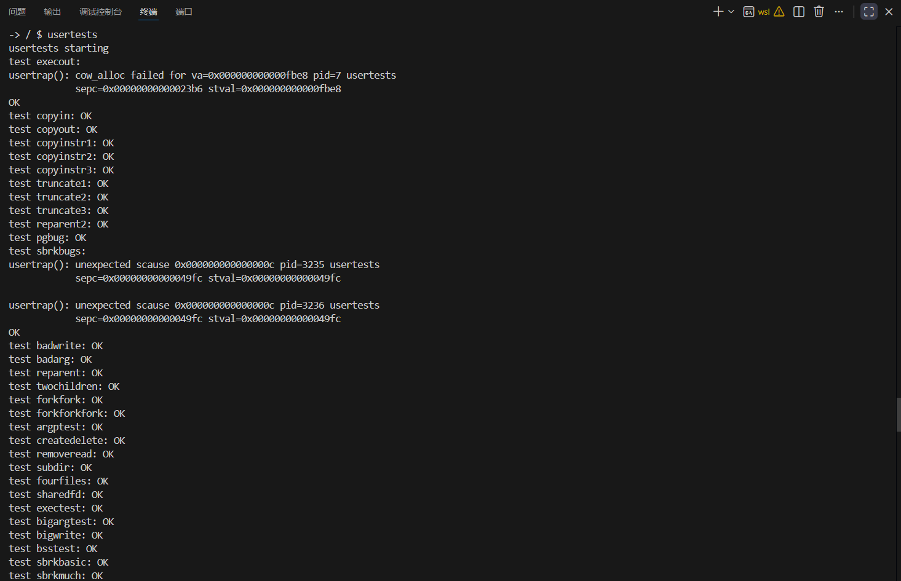

# 改进说明：写时复制（Copy-on-Write）

## 概述

本次改进为 xv6-k210 操作系统实现了 **写时复制（Copy-on-Write, COW）** 机制。这是改进计划中第一阶段的核心功能之一，可以显著提升 `fork()` 系统调用的性能。

## 改进动机

原 xv6 系统在 `fork()` 时会完全复制父进程的物理内存到子进程，这存在以下问题：

1. **内存效率低**：fork 后立即 exec 的情况下，复制操作浪费大量内存和 CPU 时间
2. **fork 性能差**：对于大内存进程，fork 调用延迟很高
3. **内存占用高**：父子进程物理内存完全独立，无法共享

## 实现方案

整体思路还是走常见的 COW：fork 时不再把用户内存整段拷贝，而是让父子先共享同一批物理页，把原本可写的页暂时改成只读并打上 COW 标志；之后谁真正去写，就在写保护异常里现场分配新页、拷贝旧页内容，再把写入方的映射切到新页上。思路不复杂，但实现最麻烦的主要就两点：引用计数必须绝对可靠，以及要把内核里“会写用户内存”的路径一并兜住。

我先在页表项里加了一个 COW 标志位，借用 RISC-V Sv39 保留位的第 9 位（PTE_COW）。这样判断是否为 COW 页就很直接：查 PTE 里这个位是否置位即可。这里的风险更多在选位，选错了和其他位冲突会导致各种怪现象，而且很难第一时间想到根因。

接着是页引用计数，这一步最折磨。COW 的本质是多个 PTE 指向同一物理页，如果还像原来那样 kfree 直接丢回 freelist，就很容易 double free 或 use-after-free。我在 kalloc.c 里维护 ref_count，释放时先 decref，只有 refcount 归零才真正 free。调试时最恶心的是“少加一次不会立刻炸”，经常要等子进程退出或某段内存被回收才突然 panic。

fork 的核心改在 uvmcopy：不再逐页分配+memcpy，而是尽量共享。遇到可写页时，把父进程对应 PTE 的 PTE_W 清掉并标记为 PTE_COW，同时子进程映射同一个物理页，也保持只读+PTE_COW。父进程也要一起改只读，否则父继续写不会 fault，COW 直接失效。另外共享后一定要 incref，否则子进程退出 decref 到 0 把页释放了，父进程还在用就会立刻崩。

写入时分裂放在 usertrap 里处理：识别写相关 page fault（scause 13/15），用 stval 的 VA 判断是否 COW 页，是的话调用 cow_alloc 分配新页并拷贝内容，更新当前进程映射，清 PTE_COW 并恢复写权限，最后对旧页 decref。这里容易踩的坑是权限位恢复不完整或忘记清 COW，导致反复 fault；还有就是映射更新后 TLB 一致性没处理好，会出现“页表改了但 CPU 还在用旧映射”的诡异不稳定问题。

最后一个隐藏坑是 copyout。很多人以为只处理 page fault 就够了，但内核也会写用户空间，比如 read 把数据拷到用户 buffer 会走 copyout，这个写入不会触发用户态 fault。如果 copyout 不识别 COW 并先分裂，内核就会直接写共享物理页，导致父子互相污染，而且表现为“偶发失效”很难定位。所以我在 copyout 里检测目标 PTE 是否带 PTE_COW，必要时先 cow_alloc 再继续拷贝，这一步补齐后整体才真正稳定。

## 测试结果分析

### 测试输出

### 结果分析

#### Test 1: 基本 COW 测试

* **测试设计** :
  父进程分配 1 页大小内存并全部初始化为 'A'，随后 fork。子进程对页内两个位置（首字节 data[0] 与末字节 data[4095]）写入 'X'、'Y'，以触发写保护异常进入 COW 复制流程，并在子进程内读取自检写入是否生效。父进程等待子进程退出后读取同样位置，期望仍为 'A'，用父子两侧同时验证“写者可见修改、非写者不受影响”。
* **结果分析** :
  输出显示子进程修改成功且父进程数据保持不变并 PASS，说明 fork 后父子对共享页建立了只读共享关系，子进程首次写入触发了正确的 COW 分裂，且分裂后的修改不会传播到父进程视图。该测试直接覆盖并证明了 COW 的核心语义链路（写保护 fault→分配新页→拷贝→更新页表/权限）。

#### Test 2: 多页面 COW 测试

* **测试设计** :
  父进程分配连续 10 页内存并初始化为 'B'，fork 后子进程对每一页的页首字节 data[i*4096] 写入不同字符，形成多页写入从而触发多次 COW 分裂。父进程在子进程结束后遍历检查每一页的页首字节仍为 'B'，以验证多页场景下子进程写入不会污染父进程对应页。
* **结果分析** :
  输出显示父进程侧“all pages preserved”并 PASS，说明在多页范围内 COW 分裂不会导致父进程的页内容被误修改，页粒度隔离基本成立。需要注意该用例当前主要验证父侧结果，未显式校验子进程退出码或子侧写入自检，因此严格性上仍有进一步增强空间，但从整体测试集的连续通过看，多页 COW 的基本路径是通的。

#### Test 3: 父进程修改测试

* **测试设计** :
  父进程分配 1 页并设置 data[0]='P' 后 fork。父进程延时把 data[0] 改为 'Q'，按预期应触发 COW 使父进程获得独立副本；子进程再延时读取 data[0]，期望仍为 'P'，用于验证“父写触发 COW”以及父写不会影响子视图。
* **结果分析** :
  输出显示父进程修改后自检成功，子进程仍看到原值并 PASS，说明 COW 的只读共享/写时分裂机制对父写同样生效，验证了实现不是只对子进程单边触发，而是符合父子对称的 COW 语义。

#### Test 4: 多次 fork 测试

* **测试设计** :
  父进程分配 1 页并设置 data[0]='M'，随后连续 fork 5 个子进程。每个子进程把同一逻辑地址 data[0] 写成各自不同的值（'0'+i），并在子进程内读取自检，成功则打印一个点号作为完成标记。父进程等待所有子进程退出后检查 data[0] 仍为 'M'，用于验证共享页在多分支写入下能正确分裂为多个私有副本且父进程不被任何子进程写入污染。
* **结果分析** :
  输出中出现多个点号并最终显示父进程数据未变化且 PASS，表明各子进程确实完成写入并读回自写值，同时父进程仍保持原值。这说明在“多个子进程同时从同一共享页分裂”的场景下，页表更新与共享页管理（含引用关系）至少在该规模下没有出现明显串改或崩溃问题。

#### Test 5: fork+exec 模式测试

* **测试设计** :
  父进程分配并初始化较大内存（10 页），随后 fork，子进程不进行写入而是快速释放并退出，用以模拟常见的 fork 后迅速 exec/退出的模式特征，观察大内存场景下 fork 是否能稳定完成且不需要在 fork 阶段进行不必要的全量拷贝。父进程等待回收后输出结果。
* **结果分析** :
  输出显示该模式通过并 PASS，说明在较大内存占用下 fork 与子进程快速结束的路径能够正常运行，COW 相关的页表复制与资源回收流程未暴露明显错误。不过由于测试未真正调用 exec，它对“exec 替换地址空间时的 COW 清理/引用计数处理”不构成强验证，更偏向对稳定性与基础路径完整性的确认。

## 意外收获

我在原始的README文档中看见有一个尚未修复的bug：解决用户态由于未知原因导致 panic 的 bug，初始bug如下：

加入cow机制后，bug得以解决，结果如下：

测试均通过，没有出现panic现象
